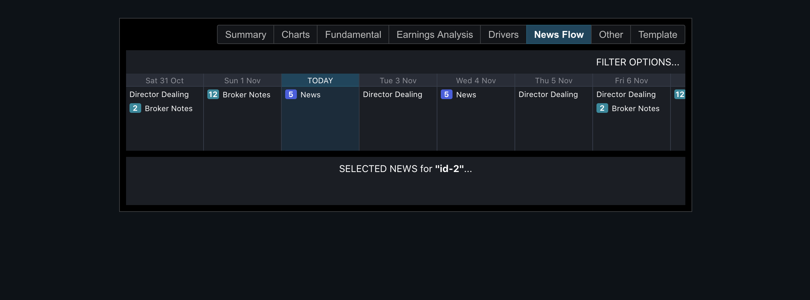

# News Screen

[](https://github.com/matt-dunn/demo-news/actions)

## Links

- **[News Component](https://matt-dunn.github.io/demo-news/)**
- [Component Stories](https://matt-dunn.github.io/demo-news/storybook/) (Storybook)

---

If you want to see some other work I've but together you can see here:

- [GitHub](https://github.com/matt-dunn)
- [CodePen](https://codepen.io/matt-j-dunn)

---

## Notes



Based on [screen](https://projects.invisionapp.com/share/WQZ407CTRVP#/screens/434811141).

- I spent 2-3 hours on this so I picked one main section of the full set of components as shown above
- I picked the colours from the supplied image as best I could without a defined palette
- The whitespace / margin / padding may not be spot on as I ran out of time to accurately measure every part of the design as I would normally do
- I've not used domain language for the components or object model 
- State management - I didn't have time to implement app state; depending on the technical solution I would use Redux for state management with 
  perhaps redux-saga or redux-observable if more complex action payload processing is required.
- Used create-react-app to quickly bootstrap with typescript template. I would normally build the project up from scratch
  to keep the config/deps lightweight (and to have full control over webpack). I would consider ejecting if more complex configuration was needed.
- Did not have time to write any Tests! Would use:
    - enzyme for components
    - jest-axe for any automated accessibility testing (aria, contrast etc.) but no replacement for full manual accessibility testing...
    - might use cypress for smoke / sanity functional testing or functional integration testing
    - browserstack for full x-browser functional testing
    - code would be written as pure functions where possible (side effects abstracted away)
- Theming...
  - I've used css vars here - could be SASS vars etc. instead; decision would be based on browser support etc.
  - the whitespace - margin/padding/etc. - have not been standardise due to time
- I've knocked up a few simple visual components (e.g. Button, ButtonGroup) but other options might be material-ui, bootstrap, etc. I would normally prefer SASS over vanilla CSS if it's needed in a project.
- Linting - I have not had time to set up all the ESLint rules I would normally do, including:
  - react hooks plugin
  - stylelint (inc. styled-components JSX plugin)
- Other considerations
    - lazy loading / code splitting
    - optimisation with memo components / hooks
    - responsive / mobile - I only had time to do very basic responsiveness
     
## Getting started

```shell script
yarn install
```

## Build

```shell script
yarn build
```

Build artifacts can be found in the ```build``` directory.
 
## Development

```shell script
yarn start
```

## Storybook

### Dev

```shell script
yarn storybook
```

### Build

```shell script
yarn storybook:build
```
